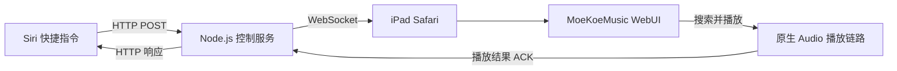

# MoeKoe Siri Control


MoeKoe Siri Control 是我为 [MoeKoeMusic](https://github.com/MoeKoeMusic/MoeKoeMusic) WebUI 做的一套局域网语音点歌桥接。

目标很直接：对 Siri 说出歌名，让家里的 iPad 开始播放。Siri 快捷指令只负责提交请求，实际的搜索、播放和状态确认都由 MoeKoeMusic 页面完成。

> 这是一个个人使用场景下的工程项目，目前主要在 Windows 主机和 iPad Safari 上验证。

## 工作方式



一次点歌请求大致会经过下面几步：

1. Siri 快捷指令向控制服务提交歌曲名。
2. 控制服务把命令发送给已经配对的 iPad 页面。
3. 页面调用 MoeKoeMusic 的搜索接口，并通过 `PlayerControl.addSongToQueue()` 播放歌曲。
4. 客户端确认目标歌曲确实开始播放后，再把结果返回给快捷指令。

如果 iPad 页面暂时处于后台或 WebSocket 已断开，请求会进入一个短期离线槽；页面恢复后会自动重连并接收尚未过期的命令。

## 主要功能

- Siri 快捷指令语音点歌
- HTTP 到 WebSocket 的命令桥接
- 单一配对控制器，避免多个页面同时响应
- Token 认证、Origin 校验、心跳检测和断线重连
- 播放结果确认，而不是发送命令后直接假定成功
- iPad 后台恢复后的离线命令补发
- 登录状态刷新与可选的服务端会话恢复
- Windows 一键启动、停止、状态检查和诊断脚本

## 使用限制

- 当前按单台 iPad 播放器设计，不是多房间播放系统。
- 只建议在可信局域网内使用，不要把控制端口直接暴露到公网。
- 一键启动和防火墙脚本面向 Windows；核心 Node.js 服务本身没有绑定 Windows API。
- 项目依赖本地的 MoeKoeMusic 源码与构建产物。

## 环境要求

- Node.js 20 或更高版本
- Windows 10/11
- 与 Windows 主机处于同一局域网的 iPhone/iPad
- 已安装依赖的 MoeKoeMusic 源码目录

## 快速开始

### 1. 准备仓库

```powershell
git clone https://github.com/MoeKoeMusic/MoeKoeMusic.git
git clone https://github.com/meeeil/MoeKoeSiriControl.git

cd MoeKoeMusic
npm install

cd ..\MoeKoeSiriControl
npm install
Copy-Item .env.example .env
```

### 2. 修改 `.env`

至少需要配置下面几项：

```dotenv
MOEKOE_DIR=C:\path\to\MoeKoeMusic
MOEKOE_DIST_DIR=C:\path\to\MoeKoeMusic\dist

# 将 192.168.1.100 替换为 Windows 主机的局域网 IP
WEB_ORIGINS=http://192.168.1.100:8080,http://127.0.0.1:8080,http://localhost:8080

SIRI_HTTP_TOKEN=请填写至少32字节的随机字符串
SIRI_WS_TOKEN=请填写另一条至少32字节的随机字符串
```

两个 Token 必须不同。可以用 Node.js 生成随机值：

```powershell
node -e "console.log(require('crypto').randomBytes(32).toString('hex'))"
```

运行两次，将结果分别填入 `SIRI_HTTP_TOKEN` 和 `SIRI_WS_TOKEN`。

`KUGOU_USERNAME` 与 `KUGOU_PASSWORD` 是可选项，只用于登录失效后的自动恢复；留空时该功能不会启用。

### 3. 构建并启动

```powershell
npm run build:web
npm run verify:web
npm run start:all
npm run status
```

默认端口：

| 端口 | 用途 |
| --- | --- |
| `6521` | MoeKoeMusic API，仅在本机监听 |
| `8080` | WebUI、静态资源和 `/api` 反向代理 |
| `8200` | WebSocket、Siri HTTP API 和健康检查 |

如果 iPad 无法访问 Windows 主机，可以用管理员 PowerShell 添加项目自己的防火墙规则：

```powershell
powershell -ExecutionPolicy Bypass -File scripts/firewall.ps1 -Apply
```

### 4. 配对 iPad

在 iPad Safari 中打开：

```text
http://192.168.1.100:8080/siri/pair
```

将 IP 换成 Windows 主机的实际局域网 IP，然后输入 `SIRI_HTTP_TOKEN`。配对成功后，这台设备会成为唯一接收点歌命令的控制器。

### 5. 配置 Siri 快捷指令

在“快捷指令”中添加“获取 URL 内容”操作：

- 方法：`POST`
- URL：`http://192.168.1.100:8200/api/siri/play`
- Header：`x-siri-token: <SIRI_HTTP_TOKEN>`
- JSON 请求体：`{"query":"快捷指令输入的歌曲名"}`

一个最简单的流程是“听写文本”后，把听写结果作为 `query` 提交。服务在线时会返回实际播放结果；iPad 暂时离线时会返回 `202 queued`。

## 常用命令

| 命令 | 作用 |
| --- | --- |
| `npm run build:web` | 构建 MoeKoeMusic WebUI 并注入 Siri 控制脚本 |
| `npm run verify:web` | 检查构建产物、API 路径和注入结果 |
| `npm run start:all` | 启动 API、Web host 和控制服务 |
| `npm run status` | 查看端口与进程状态 |
| `npm run stop:all` | 停止本项目启动的服务 |
| `npm test` | 运行 Node.js 自动化测试 |

遇到问题时可以先运行只读诊断脚本：

```powershell
powershell -ExecutionPolicy Bypass -File scripts/doctor.ps1
```

## HTTP API

### 提交点歌请求

```http
POST /api/siri/play
x-siri-token: <SIRI_HTTP_TOKEN>
Content-Type: application/json

{"query":"七里香"}
```

- 控制器在线并完成播放确认：返回 `200`
- 控制器暂时离线：返回 `202`，命令进入短期离线槽
- Token 缺失或错误：返回 `401`

### 查询离线命令状态

```http
GET /api/siri/commands/<reqId>
x-siri-token: <SIRI_HTTP_TOKEN>
```

状态可能为 `queued`、`dispatched`、`succeeded`、`failed`、`expired` 或 `superseded`。

### 健康检查

```http
GET /health
```

## 安全说明

- `.env`、运行日志、控制器信息和本地备份均已加入 `.gitignore`。
- HTTP Token 与 WebSocket Token 权限不同，并且必须使用不同的随机值。
- 配对 Cookie 使用 HMAC 派生，账号密码不会发给浏览器，也不会写入日志。
- 登录接口包含超时、单飞、冷却和请求预算限制，避免异常情况下反复请求上游。
- 本项目没有为公网部署设计 TLS、反向代理鉴权或多用户权限模型。

## 项目结构

```text
MoeKoeSiriControl/
├── client/                 # 注入 WebUI 的客户端、WS 重连和命令处理
├── server/                 # Web host、控制服务、HTTP API、配对与会话恢复
├── scripts/                # 构建、启停、诊断和防火墙脚本
├── test/                   # 单元测试与端到端测试
├── docs/                   # 设计与运维记录
├── .env.example
├── package.json
└── vite.siri.config.mjs
```

当前测试覆盖搜索结果解析、播放器控制、WebSocket 协议、配对、HTTP API、离线命令、会话恢复和端到端播放链路。公开前在 Node.js 24 环境运行结果为 **202 项通过**。

## MoeKoeMusic 上游贡献

这个项目也推动了几处 MoeKoeMusic 播放器修复，相关 PR 已被上游合并：

- [#1133 - 正确处理默认音频输出设备](https://github.com/MoeKoeMusic/MoeKoeMusic/pull/1133)
- [#1134 - 拆分 Media Session 的播放与暂停动作](https://github.com/MoeKoeMusic/MoeKoeMusic/pull/1134)
- [#1135 - 切歌时清理旧进度与高潮点状态](https://github.com/MoeKoeMusic/MoeKoeMusic/pull/1135)

## 致谢

感谢 [MoeKoeMusic](https://github.com/MoeKoeMusic/MoeKoeMusic) 项目提供播放器和 WebUI 基础。
